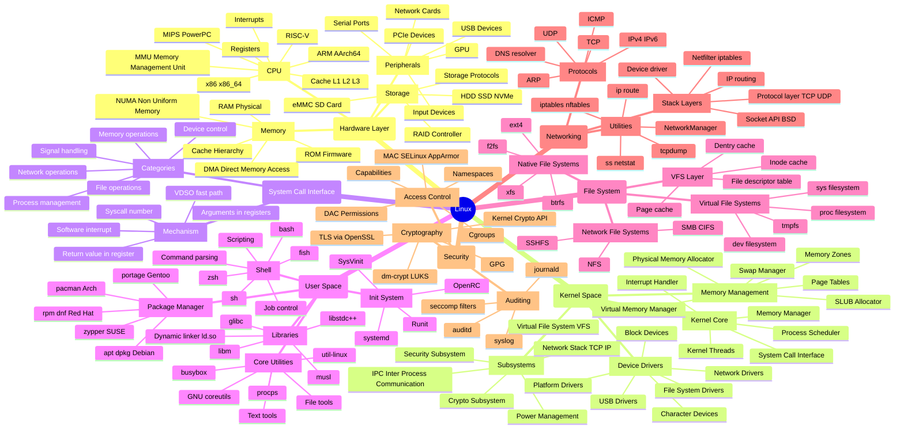
```mermaid
mindmap
  root((Linux))
    (Hardware Layer)
      [CPU]
        x86 x86_64
        ARM AArch64
        RISC-V
        MIPS PowerPC
        Registers
        Cache L1 L2 L3
        MMU Memory Management Unit
        Interrupts
      [Memory]
        RAM Physical
        ROM Firmware
        Cache Hierarchy
        DMA Direct Memory Access
        NUMA Non Uniform Memory
      [Storage]
        HDD SSD NVMe
        eMMC SD Card
        RAID Controller
        Storage Protocols
      [Peripherals]
        Network Cards
        GPU
        USB Devices
        PCIe Devices
        Serial Ports
        Input Devices

    (Kernel Space)
      [Kernel Core]
        Process Scheduler
        Memory Manager
        Interrupt Handler
        System Call Interface
        Kernel Threads
      [Device Drivers]
        Character Devices
        Block Devices
        Network Drivers
        File System Drivers
        USB Drivers
        Platform Drivers
      [Subsystems]
        Virtual File System VFS
        Network Stack TCP IP
        IPC Inter Process Communication
        Security Subsystem
        Power Management
        Crypto Subsystem
      [Memory Management]
        Physical Memory Allocator
        Virtual Memory Manager
        Page Tables
        Swap Manager
        SLUB Allocator
        Memory Zones

    (System Call Interface)
      [Categories]
        Process management
        File operations
        Network operations
        Memory operations
        Signal handling
        Device control
      [Mechanism]
        Syscall number
        Software interrupt
        VDSO fast path
        Arguments in registers
        Return value in register

    (User Space)
      [Init System]
        systemd
        SysVinit
        OpenRC
        Runit
      [Shell]
        bash
        zsh
        sh
        fish
        Command parsing
        Job control
        Scripting
      [Core Utilities]
        GNU coreutils
        busybox
        util-linux
        procps
        File tools
        Text tools
      [Libraries]
        glibc
        musl
        libstdc++
        libm
        Dynamic linker ld.so
      [Package Manager]
        apt dpkg Debian
        rpm dnf Red Hat
        pacman Arch
        zypper SUSE
        portage Gentoo

    (File System)
      [VFS Layer]
        Inode cache
        Dentry cache
        Page cache
        File descriptor table
      [Native File Systems]
        ext4
        xfs
        btrfs
        f2fs
      [Network File Systems]
        NFS
        SMB CIFS
        SSHFS
      [Virtual File Systems]
        proc filesystem
        sys filesystem
        dev filesystem
        tmpfs

    (Networking)
      [Stack Layers]
        Socket API BSD
        Protocol layer TCP UDP
        IP routing
        Netfilter iptables
        Device driver
      [Protocols]
        TCP
        UDP
        ICMP
        IPv4 IPv6
        ARP
        DNS resolver
      [Utilities]
        ip route
        ss netstat
        iptables nftables
        tcpdump
        NetworkManager

    (Security)
      [Access Control]
        DAC Permissions
        MAC SELinux AppArmor
        Capabilities
        Namespaces
        Cgroups
      [Cryptography]
        Kernel Crypto API
        dm-crypt LUKS
        TLS via OpenSSL
        GPG
      [Auditing]
        auditd
        syslog
        journald
        seccomp filters

```

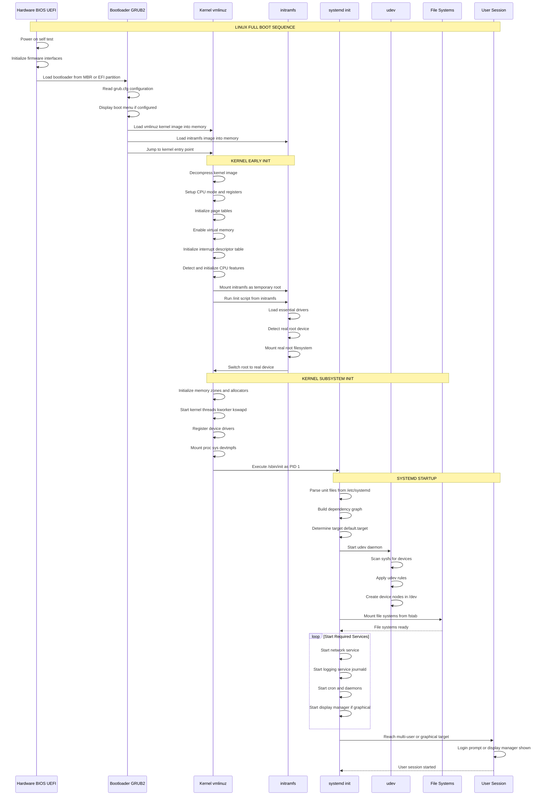
```mermaid
sequenceDiagram
    participant HW as Hardware BIOS UEFI
    participant GRUB as Bootloader GRUB2
    participant KERNEL as Kernel vmlinuz
    participant INITRAMFS as initramfs
    participant INIT as systemd init
    participant UDEV as udev
    participant FS as File Systems
    participant USER as User Session

    Note over HW,USER: LINUX FULL BOOT SEQUENCE

    HW->>HW: Power on self test
    HW->>HW: Initialize firmware interfaces
    HW->>GRUB: Load bootloader from MBR or EFI partition

    GRUB->>GRUB: Read grub.cfg configuration
    GRUB->>GRUB: Display boot menu if configured
    GRUB->>KERNEL: Load vmlinuz kernel image into memory
    GRUB->>INITRAMFS: Load initramfs image into memory
    GRUB->>KERNEL: Jump to kernel entry point

    Note over KERNEL,INITRAMFS: KERNEL EARLY INIT

    KERNEL->>KERNEL: Decompress kernel image
    KERNEL->>KERNEL: Setup CPU mode and registers
    KERNEL->>KERNEL: Initialize page tables
    KERNEL->>KERNEL: Enable virtual memory
    KERNEL->>KERNEL: Initialize interrupt descriptor table
    KERNEL->>KERNEL: Detect and initialize CPU features

    KERNEL->>INITRAMFS: Mount initramfs as temporary root
    KERNEL->>INITRAMFS: Run /init script from initramfs
    INITRAMFS->>INITRAMFS: Load essential drivers
    INITRAMFS->>INITRAMFS: Detect real root device
    INITRAMFS->>INITRAMFS: Mount real root filesystem
    INITRAMFS->>KERNEL: Switch root to real device

    Note over KERNEL,FS: KERNEL SUBSYSTEM INIT

    KERNEL->>KERNEL: Initialize memory zones and allocators
    KERNEL->>KERNEL: Start kernel threads kworker kswapd
    KERNEL->>KERNEL: Register device drivers
    KERNEL->>KERNEL: Mount proc sys devtmpfs

    KERNEL->>INIT: Execute /sbin/init as PID 1

    Note over INIT,USER: SYSTEMD STARTUP

    INIT->>INIT: Parse unit files from /etc/systemd
    INIT->>INIT: Build dependency graph
    INIT->>INIT: Determine target default.target

    INIT->>UDEV: Start udev daemon
    UDEV->>UDEV: Scan sysfs for devices
    UDEV->>UDEV: Apply udev rules
    UDEV->>UDEV: Create device nodes in /dev

    INIT->>FS: Mount file systems from fstab
    FS-->>INIT: File systems ready

    loop Start Required Services
        INIT->>INIT: Start network service
        INIT->>INIT: Start logging service journald
        INIT->>INIT: Start cron and daemons
        INIT->>INIT: Start display manager if graphical
    end

    INIT->>USER: Reach multi-user or graphical target
    USER->>USER: Login prompt or display manager shown
    USER-->>INIT: User session started
```

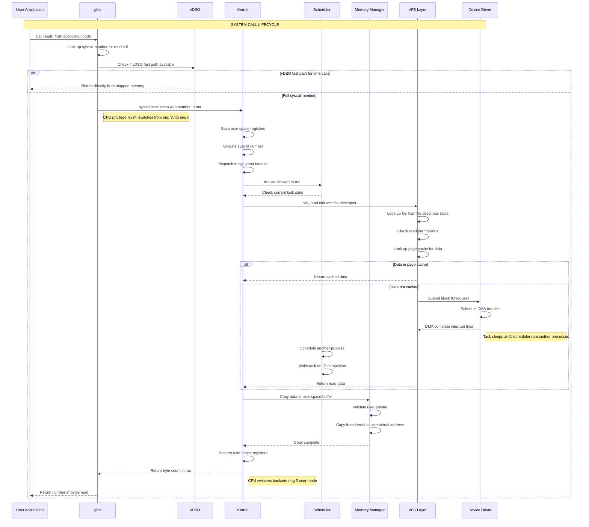
```mermaid
sequenceDiagram
    participant App as User Application
    participant LIBC as glibc
    participant VDSO as vDSO
    participant KERNEL as Kernel
    participant SCHED as Scheduler
    participant MM as Memory Manager
    participant VFS as VFS Layer
    participant DRIVER as Device Driver

    Note over App,DRIVER: SYSTEM CALL LIFECYCLE

    App->>LIBC: Call read() from application code
    LIBC->>LIBC: Look up syscall number for read = 0
    LIBC->>VDSO: Check if vDSO fast path available

    alt vDSO fast path for time calls
        VDSO-->>App: Return directly from mapped memory
    else Full syscall needed
        LIBC->>KERNEL: syscall instruction with number in rax
        Note right of LIBC: CPU privilege level\nswitches from ring 3\nto ring 0

        KERNEL->>KERNEL: Save user space registers
        KERNEL->>KERNEL: Validate syscall number
        KERNEL->>KERNEL: Dispatch to sys_read handler

        KERNEL->>SCHED: Are we allowed to run
        SCHED-->>KERNEL: Check current task state

        KERNEL->>VFS: vfs_read call with file descriptor
        VFS->>VFS: Look up file from file descriptor table
        VFS->>VFS: Check read permissions
        VFS->>VFS: Look up page cache for data

        alt Data in page cache
            VFS-->>KERNEL: Return cached data
        else Data not cached
            VFS->>DRIVER: Submit block IO request
            DRIVER->>DRIVER: Schedule DMA transfer
            DRIVER-->>VFS: DMA complete interrupt fires

            Note right of DRIVER: Task sleeps and\nscheduler runs\nother processes
            SCHED->>SCHED: Schedule another process
            SCHED->>SCHED: Wake task on IO completion
            VFS-->>KERNEL: Return read data
        end

        KERNEL->>MM: Copy data to user space buffer
        MM->>MM: Validate user pointer
        MM->>MM: Copy from kernel to user virtual address
        MM-->>KERNEL: Copy complete

        KERNEL->>KERNEL: Restore user space registers
        KERNEL-->>LIBC: Return byte count in rax
        Note right of KERNEL: CPU switches back\nto ring 3 user mode
        LIBC-->>App: Return number of bytes read
    end
```

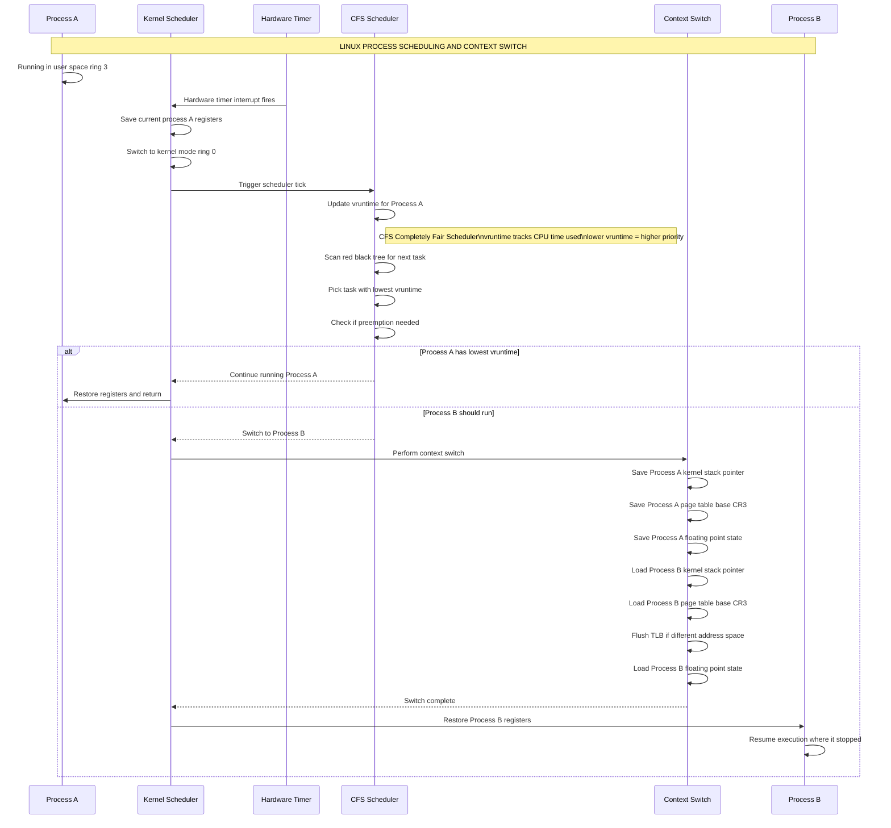
```mermaid
sequenceDiagram
    participant App as Process A
    participant KERNEL as Kernel Scheduler
    participant TIMER as Hardware Timer
    participant SCHED as CFS Scheduler
    participant CTX as Context Switch
    participant Process as Process B

    Note over App,Process: LINUX PROCESS SCHEDULING AND CONTEXT SWITCH

    App->>App: Running in user space ring 3
    TIMER->>KERNEL: Hardware timer interrupt fires
    KERNEL->>KERNEL: Save current process A registers
    KERNEL->>KERNEL: Switch to kernel mode ring 0

    KERNEL->>SCHED: Trigger scheduler tick
    SCHED->>SCHED: Update vruntime for Process A
    Note right of SCHED: CFS Completely Fair Scheduler\nvruntime tracks CPU time used\nlower vruntime = higher priority

    SCHED->>SCHED: Scan red black tree for next task
    SCHED->>SCHED: Pick task with lowest vruntime
    SCHED->>SCHED: Check if preemption needed

    alt Process A has lowest vruntime
        SCHED-->>KERNEL: Continue running Process A
        KERNEL->>App: Restore registers and return
    else Process B should run
        SCHED-->>KERNEL: Switch to Process B
        KERNEL->>CTX: Perform context switch

        CTX->>CTX: Save Process A kernel stack pointer
        CTX->>CTX: Save Process A page table base CR3
        CTX->>CTX: Save Process A floating point state
        CTX->>CTX: Load Process B kernel stack pointer
        CTX->>CTX: Load Process B page table base CR3
        CTX->>CTX: Flush TLB if different address space
        CTX->>CTX: Load Process B floating point state

        CTX-->>KERNEL: Switch complete
        KERNEL->>Process: Restore Process B registers
        Process->>Process: Resume execution where it stopped
    end
```

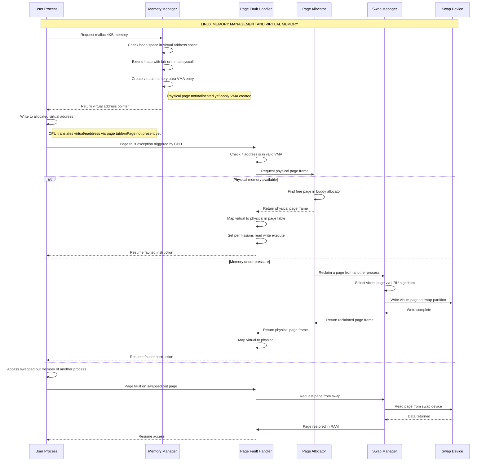
```mermaid
sequenceDiagram
    participant App as User Process
    participant MM as Memory Manager
    participant PAGE as Page Fault Handler
    participant ALLOC as Page Allocator
    participant SWAP as Swap Manager
    participant DISK as Swap Device

    Note over App,DISK: LINUX MEMORY MANAGEMENT AND VIRTUAL MEMORY

    App->>MM: Request malloc 4KB memory
    MM->>MM: Check heap space in virtual address space
    MM->>MM: Extend heap with brk or mmap syscall
    MM->>MM: Create virtual memory area VMA entry
    Note right of MM: Physical page not\nallocated yet\nonly VMA created
    MM-->>App: Return virtual address pointer

    App->>App: Write to allocated virtual address
    Note right of App: CPU translates virtual\naddress via page table\nPage not present yet

    App->>PAGE: Page fault exception triggered by CPU
    PAGE->>PAGE: Check if address is in valid VMA
    PAGE->>ALLOC: Request physical page frame

    alt Physical memory available
        ALLOC->>ALLOC: Find free page in buddy allocator
        ALLOC-->>PAGE: Return physical page frame
        PAGE->>PAGE: Map virtual to physical in page table
        PAGE->>PAGE: Set permissions read write execute
        PAGE-->>App: Resume faulted instruction
    else Memory under pressure
        ALLOC->>SWAP: Reclaim a page from another process
        SWAP->>SWAP: Select victim page via LRU algorithm
        SWAP->>DISK: Write victim page to swap partition
        DISK-->>SWAP: Write complete
        SWAP->>ALLOC: Return reclaimed page frame
        ALLOC-->>PAGE: Return physical page frame
        PAGE->>PAGE: Map virtual to physical
        PAGE-->>App: Resume faulted instruction
    end

    App->>App: Access swapped out memory of another process
    App->>PAGE: Page fault on swapped out page
    PAGE->>SWAP: Request page from swap
    SWAP->>DISK: Read page from swap device
    DISK-->>SWAP: Data returned
    SWAP->>PAGE: Page restored in RAM
    PAGE-->>App: Resume access
```

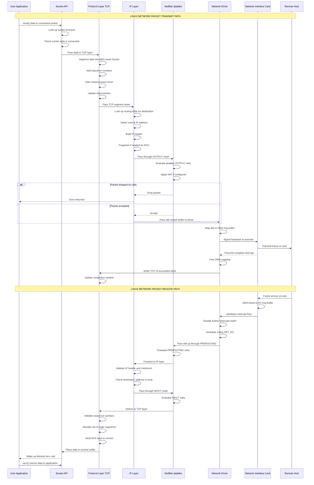
```mermaid
sequenceDiagram
    participant App as User Application
    participant SOCKET as Socket API
    participant PROTO as Protocol Layer TCP
    participant IP as IP Layer
    participant NETFILTER as Netfilter iptables
    participant DRIVER as Network Driver
    participant NIC as Network Interface Card
    participant REMOTE as Remote Host

    Note over App,REMOTE: LINUX NETWORK PACKET TRANSMIT PATH

    App->>SOCKET: send() data to connected socket
    SOCKET->>SOCKET: Look up socket structure
    SOCKET->>SOCKET: Check socket state is connected
    SOCKET->>PROTO: Pass data to TCP layer

    PROTO->>PROTO: Segment data into MSS sized chunks
    PROTO->>PROTO: Add sequence numbers
    PROTO->>PROTO: Start retransmission timer
    PROTO->>PROTO: Update send window
    PROTO->>IP: Pass TCP segment down

    IP->>IP: Look up routing table for destination
    IP->>IP: Select source IP address
    IP->>IP: Build IP header
    IP->>IP: Fragment if needed for MTU

    IP->>NETFILTER: Pass through OUTPUT chain
    NETFILTER->>NETFILTER: Evaluate iptables OUTPUT rules
    NETFILTER->>NETFILTER: Apply NAT if configured

    alt Packet dropped by rule
        NETFILTER-->>IP: Drop packet
        IP-->>App: Error returned
    else Packet accepted
        NETFILTER-->>IP: Accept
        IP->>DRIVER: Pass skb socket buffer to driver
    end

    DRIVER->>DRIVER: Map skb to DMA ring buffer
    DRIVER->>NIC: Signal hardware to transmit
    NIC->>REMOTE: Transmit frame on wire

    NIC-->>DRIVER: Transmit complete interrupt
    DRIVER->>DRIVER: Free DMA mapping
    DRIVER->>PROTO: Notify TCP of successful send
    PROTO->>PROTO: Update congestion window

    Note over App,REMOTE: LINUX NETWORK PACKET RECEIVE PATH

    REMOTE->>NIC: Frame arrives on wire
    NIC->>NIC: DMA frame to RX ring buffer
    NIC->>DRIVER: Hardware interrupt fires

    DRIVER->>DRIVER: Disable further interrupts NAPI
    DRIVER->>DRIVER: Schedule softirq NET_RX
    DRIVER->>NETFILTER: Pass skb up through PREROUTING
    NETFILTER->>NETFILTER: Evaluate PREROUTING rules
    NETFILTER->>IP: Forward to IP layer

    IP->>IP: Validate IP header and checksum
    IP->>IP: Check destination address is local
    IP->>NETFILTER: Pass through INPUT chain
    NETFILTER->>NETFILTER: Evaluate INPUT rules

    NETFILTER->>PROTO: Deliver to TCP layer
    PROTO->>PROTO: Validate sequence numbers
    PROTO->>PROTO: Reorder out of order segments
    PROTO->>PROTO: Send ACK back to remote
    PROTO->>SOCKET: Place data in receive buffer

    SOCKET-->>App: Wake up blocked recv call
    App->>SOCKET: recv() returns data to application
```

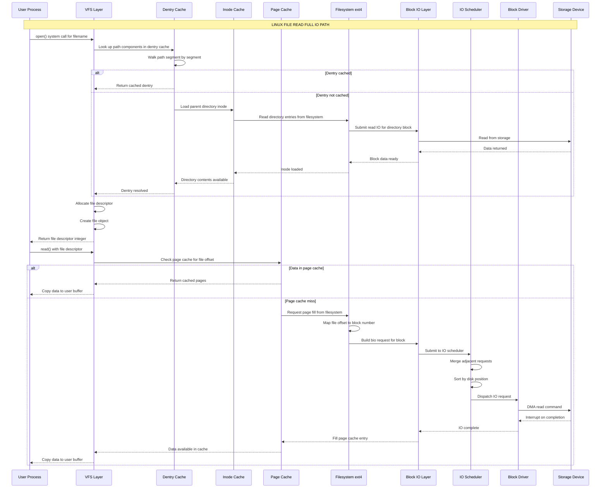
```mermaid
sequenceDiagram
    participant App as User Process
    participant VFS as VFS Layer
    participant DCACHE as Dentry Cache
    participant ICACHE as Inode Cache
    participant PCACHE as Page Cache
    participant FS as Filesystem ext4
    participant BIO as Block IO Layer
    participant SCHED as IO Scheduler
    participant DRIVER as Block Driver
    participant DISK as Storage Device

    Note over App,DISK: LINUX FILE READ FULL IO PATH

    App->>VFS: open() system call for filename
    VFS->>DCACHE: Look up path components in dentry cache
    DCACHE->>DCACHE: Walk path segment by segment

    alt Dentry cached
        DCACHE-->>VFS: Return cached dentry
    else Dentry not cached
        DCACHE->>ICACHE: Load parent directory inode
        ICACHE->>FS: Read directory entries from filesystem
        FS->>BIO: Submit read IO for directory block
        BIO->>DISK: Read from storage
        DISK-->>BIO: Data returned
        BIO-->>FS: Block data ready
        FS-->>ICACHE: Inode loaded
        ICACHE-->>DCACHE: Directory contents available
        DCACHE-->>VFS: Dentry resolved
    end

    VFS->>VFS: Allocate file descriptor
    VFS->>VFS: Create file object
    VFS-->>App: Return file descriptor integer

    App->>VFS: read() with file descriptor
    VFS->>PCACHE: Check page cache for file offset

    alt Data in page cache
        PCACHE-->>VFS: Return cached pages
        VFS-->>App: Copy data to user buffer
    else Page cache miss
        PCACHE->>FS: Request page fill from filesystem
        FS->>FS: Map file offset to block number
        FS->>BIO: Build bio request for block
        BIO->>SCHED: Submit to IO scheduler
        SCHED->>SCHED: Merge adjacent requests
        SCHED->>SCHED: Sort by disk position
        SCHED->>DRIVER: Dispatch IO request
        DRIVER->>DISK: DMA read command
        DISK-->>DRIVER: Interrupt on completion
        DRIVER-->>BIO: IO complete
        BIO-->>PCACHE: Fill page cache entry
        PCACHE-->>VFS: Data available in cache
        VFS-->>App: Copy data to user buffer
    end
```

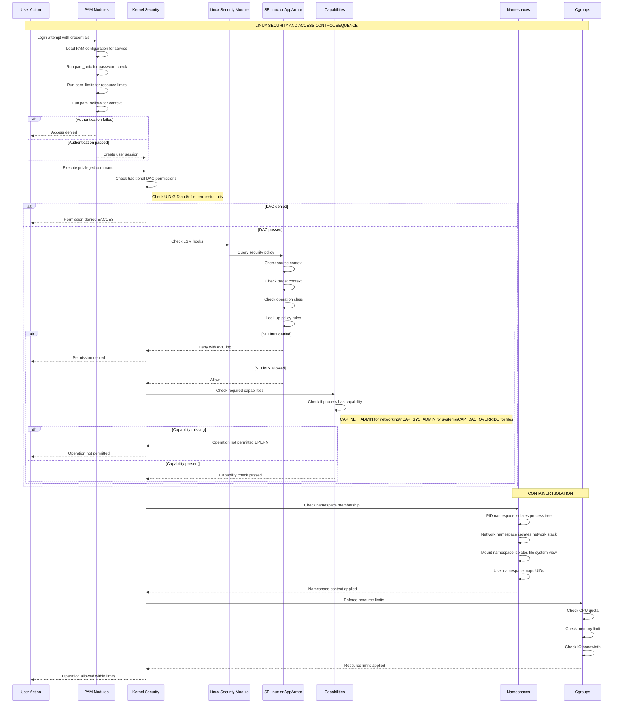
```mermaid
sequenceDiagram
    participant User as User Action
    participant PAM as PAM Modules
    participant KERNEL as Kernel Security
    participant LSM as Linux Security Module
    participant SELINUX as SELinux or AppArmor
    participant CAP as Capabilities
    participant NS as Namespaces
    participant CGROUP as Cgroups

    Note over User,CGROUP: LINUX SECURITY AND ACCESS CONTROL SEQUENCE

    User->>PAM: Login attempt with credentials
    PAM->>PAM: Load PAM configuration for service
    PAM->>PAM: Run pam_unix for password check
    PAM->>PAM: Run pam_limits for resource limits
    PAM->>PAM: Run pam_selinux for context

    alt Authentication failed
        PAM-->>User: Access denied
    else Authentication passed
        PAM-->>KERNEL: Create user session
    end

    User->>KERNEL: Execute privileged command
    KERNEL->>KERNEL: Check traditional DAC permissions
    Note right of KERNEL: Check UID GID and\nfile permission bits

    alt DAC denied
        KERNEL-->>User: Permission denied EACCES
    else DAC passed
        KERNEL->>LSM: Check LSM hooks
        LSM->>SELINUX: Query security policy

        SELINUX->>SELINUX: Check source context
        SELINUX->>SELINUX: Check target context
        SELINUX->>SELINUX: Check operation class
        SELINUX->>SELINUX: Look up policy rules

        alt SELinux denied
            SELINUX-->>KERNEL: Deny with AVC log
            KERNEL-->>User: Permission denied
        else SELinux allowed
            SELINUX-->>KERNEL: Allow
            KERNEL->>CAP: Check required capabilities

            CAP->>CAP: Check if process has capability
            Note right of CAP: CAP_NET_ADMIN for networking\nCAP_SYS_ADMIN for system\nCAP_DAC_OVERRIDE for files

            alt Capability missing
                CAP-->>KERNEL: Operation not permitted EPERM
                KERNEL-->>User: Operation not permitted
            else Capability present
                CAP-->>KERNEL: Capability check passed
            end
        end
    end

    Note over NS,CGROUP: CONTAINER ISOLATION

    KERNEL->>NS: Check namespace membership
    NS->>NS: PID namespace isolates process tree
    NS->>NS: Network namespace isolates network stack
    NS->>NS: Mount namespace isolates file system view
    NS->>NS: User namespace maps UIDs
    NS-->>KERNEL: Namespace context applied

    KERNEL->>CGROUP: Enforce resource limits
    CGROUP->>CGROUP: Check CPU quota
    CGROUP->>CGROUP: Check memory limit
    CGROUP->>CGROUP: Check IO bandwidth
    CGROUP-->>KERNEL: Resource limits applied
    KERNEL-->>User: Operation allowed within limits
```

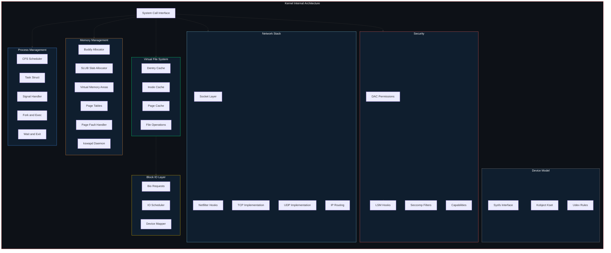
```mermaid
flowchart TD
    subgraph KERNEL_INTERNAL["Kernel Internal Architecture"]
        direction TB

        SCI[System Call Interface]

        subgraph PROCESS_MGMT["Process Management"]
            SCHED_CFS[CFS Scheduler]
            TASK[Task Struct]
            SIGNAL[Signal Handler]
            FORK[Fork and Exec]
            WAIT[Wait and Exit]
        end

        subgraph MEM_MGMT["Memory Management"]
            BUDDY[Buddy Allocator]
            SLUB[SLUB Slab Allocator]
            VMAREA[Virtual Memory Areas]
            PAGETBL[Page Tables]
            PAGEFLT[Page Fault Handler]
            KSWAPD[kswapd Daemon]
        end

        subgraph VFS_LAYER["Virtual File System"]
            DENTRY[Dentry Cache]
            INODE[Inode Cache]
            PAGECACHE[Page Cache]
            FILEOPS[File Operations]
        end

        subgraph NET_STACK["Network Stack"]
            SOCK[Socket Layer]
            TCP_LAYER[TCP Implementation]
            UDP_LAYER[UDP Implementation]
            IP_LAYER[IP Routing]
            NFILTER[Netfilter Hooks]
        end

        subgraph SECURITY_SUB["Security"]
            DAC[DAC Permissions]
            LSM_HOOK[LSM Hooks]
            SECCOMP[Seccomp Filters]
            CAPS[Capabilities]
        end

        subgraph DEVICE_MODEL["Device Model"]
            SYSFS[Sysfs Interface]
            DEVMODEL[Kobject Kset]
            UDEV_RULES[Udev Rules]
        end

        subgraph BLOCK_LAYER["Block IO Layer"]
            BIO_LAYER[Bio Requests]
            IOSCHED[IO Scheduler]
            DM[Device Mapper]
        end
    end

    SCI --> PROCESS_MGMT
    SCI --> MEM_MGMT
    SCI --> VFS_LAYER
    SCI --> NET_STACK
    SCI --> SECURITY_SUB

    VFS_LAYER --> BLOCK_LAYER
    NET_STACK --> NFILTER
    SECURITY_SUB --> LSM_HOOK
    DEVICE_MODEL --> SYSFS

    style KERNEL_INTERNAL fill:#0d1117,stroke:#ff6b6b,color:#fff
    style PROCESS_MGMT fill:#0f1e2e,stroke:#4a9eff,color:#fff
    style MEM_MGMT fill:#0f1e2e,stroke:#ff9f43,color:#fff
    style VFS_LAYER fill:#0f1e2e,stroke:#00ff88,color:#fff
    style NET_STACK fill:#0f1e2e,stroke:#7ec8e3,color:#fff
    style SECURITY_SUB fill:#0f1e2e,stroke:#ff6b6b,color:#fff
    style DEVICE_MODEL fill:#0f1e2e,stroke:#888,color:#fff
    style BLOCK_LAYER fill:#0f1e2e,stroke:#ffcc02,color:#fff
```

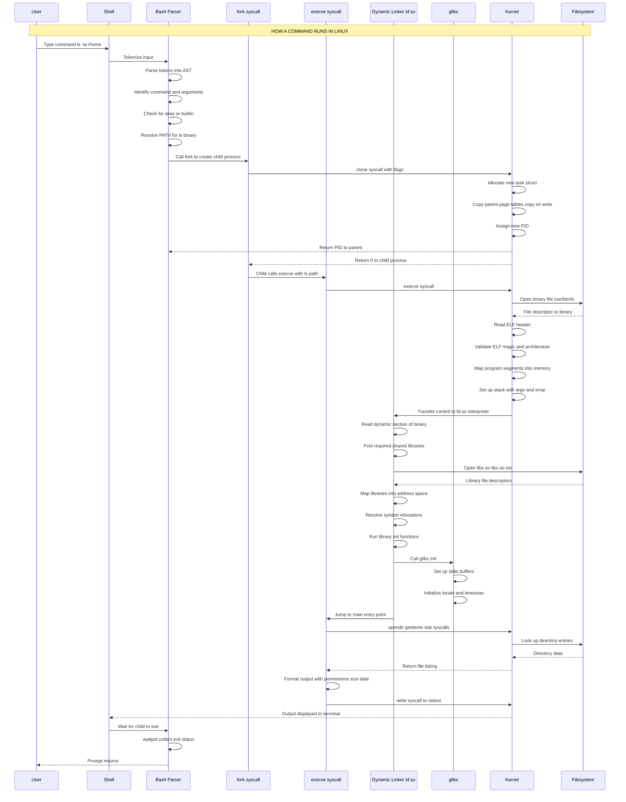
```mermaid
sequenceDiagram
    participant User as User
    participant SHELL as Shell
    participant BASH as Bash Parser
    participant FORK as fork syscall
    participant EXEC as execve syscall
    participant LOADER as Dynamic Linker ld.so
    participant LIBC as glibc
    participant KERNEL as Kernel
    participant FS as Filesystem

    Note over User,FS: HOW A COMMAND RUNS IN LINUX

    User->>SHELL: Type command ls -la /home
    SHELL->>BASH: Tokenize input
    BASH->>BASH: Parse tokens into AST
    BASH->>BASH: Identify command and arguments
    BASH->>BASH: Check for alias or builtin
    BASH->>BASH: Resolve PATH for ls binary

    BASH->>FORK: Call fork to create child process
    FORK->>KERNEL: clone syscall with flags
    KERNEL->>KERNEL: Allocate new task struct
    KERNEL->>KERNEL: Copy parent page tables copy on write
    KERNEL->>KERNEL: Assign new PID
    KERNEL-->>BASH: Return PID to parent
    KERNEL-->>FORK: Return 0 to child process

    FORK->>EXEC: Child calls execve with ls path
    EXEC->>KERNEL: execve syscall
    KERNEL->>FS: Open binary file /usr/bin/ls
    FS-->>KERNEL: File descriptor to binary
    KERNEL->>KERNEL: Read ELF header
    KERNEL->>KERNEL: Validate ELF magic and architecture
    KERNEL->>KERNEL: Map program segments into memory
    KERNEL->>KERNEL: Set up stack with argv and envp
    KERNEL->>LOADER: Transfer control to ld.so interpreter

    LOADER->>LOADER: Read dynamic section of binary
    LOADER->>LOADER: Find required shared libraries
    LOADER->>FS: Open libz.so libc.so etc
    FS-->>LOADER: Library file descriptors
    LOADER->>LOADER: Map libraries into address space
    LOADER->>LOADER: Resolve symbol relocations
    LOADER->>LOADER: Run library init functions
    LOADER->>LIBC: Call glibc init
    LIBC->>LIBC: Set up stdio buffers
    LIBC->>LIBC: Initialize locale and timezone
    LOADER->>EXEC: Jump to main entry point

    EXEC->>KERNEL: opendir getdents stat syscalls
    KERNEL->>FS: Look up directory entries
    FS-->>KERNEL: Directory data
    KERNEL-->>EXEC: Return file listing
    EXEC->>EXEC: Format output with permissions size date
    EXEC->>KERNEL: write syscall to stdout
    KERNEL-->>SHELL: Output displayed to terminal
    SHELL->>BASH: Wait for child to exit
    BASH->>BASH: waitpid collect exit status
    BASH-->>User: Prompt returns
```

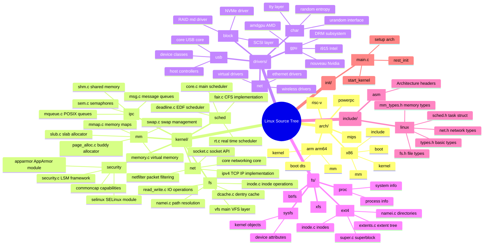
```mermaid
mindmap
  root((Linux Source Tree))
    (arch/)
      [x86]
        boot
        kernel
        mm
        include
      [arm arm64]
        boot dts
        kernel
        mm
      [risc-v]
      [mips]
      [powerpc]

    (kernel/)
      [sched]
        core.c main scheduler
        fair.c CFS implementation
        rt.c real time scheduler
        deadline.c EDF scheduler
      [mm]
        memory.c virtual memory
        page_alloc.c buddy allocator
        slub.c slab allocator
        swap.c swap management
        mmap.c memory maps
      [fs]
        vfs main VFS layer
        namei.c path resolution
        dcache.c dentry cache
        inode.c inode operations
        read_write.c IO operations
      [net]
        socket.c socket API
        core networking core
        ipv4 TCP IP implementation
        netfilter packet filtering
      [ipc]
        shm.c shared memory
        msg.c message queues
        sem.c semaphores
        mqueue.c POSIX queues
      [security]
        security.c LSM framework
        selinux SELinux module
        apparmor AppArmor module
        commoncap capabilities

    (drivers/)
      [net]
        ethernet drivers
        wireless drivers
        virtual drivers
      [block]
        NVMe driver
        SCSI layer
        RAID md driver
      [char]
        tty layer
        random entropy
        urandom interface
      [usb]
        core USB core
        host controllers
        device classes
      [gpu]
        DRM subsystem
        i915 Intel
        amdgpu AMD
        nouveau Nvidia

    (fs/)
      [ext4]
        super.c superblock
        inode.c inodes
        namei.c directories
        extents.c extent tree
      [xfs]
      [btrfs]
      [proc]
        process info
        system info
      [sysfs]
        kernel objects
        device attributes

    (include/)
      [linux]
        types.h basic types
        sched.h task struct
        mm_types.h memory types
        fs.h file types
        net.h network types
      [asm]
        Architecture headers

    (init/)
      [main.c]
        start_kernel
        setup arch
        rest_init
```

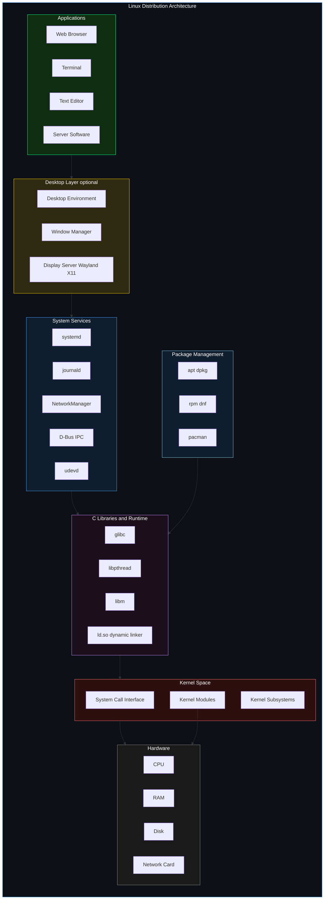
```mermaid
flowchart TD
    subgraph DISTRO["Linux Distribution Architecture"]
        direction TB

        subgraph APPS["Applications"]
            WEB[Web Browser]
            TERM[Terminal]
            EDITOR[Text Editor]
            SRV[Server Software]
        end

        subgraph DESKTOP["Desktop Layer optional"]
            DE[Desktop Environment]
            WM[Window Manager]
            DISPLAY[Display Server Wayland X11]
        end

        subgraph SYSTEM["System Services"]
            SYSD[systemd]
            JOURNAL[journald]
            NETWORKM[NetworkManager]
            DBUS[D-Bus IPC]
            UDEVD[udevd]
        end

        subgraph CLIBS["C Libraries and Runtime"]
            GLIBC[glibc]
            LIBPTHREAD[libpthread]
            LIBM[libm]
            LDSO[ld.so dynamic linker]
        end

        subgraph PKGMGR["Package Management"]
            APT[apt dpkg]
            RPM[rpm dnf]
            PACMAN[pacman]
        end

        subgraph KSPACE["Kernel Space"]
            SYSCALL[System Call Interface]
            SUBSYS[Kernel Subsystems]
            KMOD[Kernel Modules]
        end

        subgraph HWL["Hardware"]
            CPUH[CPU]
            RAMH[RAM]
            DISKH[Disk]
            NÍCH[Network Card]
        end
    end

    APPS --> DESKTOP
    DESKTOP --> SYSTEM
    SYSTEM --> CLIBS
    PKGMGR --> CLIBS
    CLIBS --> KSPACE
    KSPACE --> HWL
    KMOD --> HWL

    style DISTRO fill:#0d1117,stroke:#4a9eff,color:#fff
    style APPS fill:#0f2e0f,stroke:#00ff88,color:#fff
    style DESKTOP fill:#2e2a0f,stroke:#ffcc00,color:#fff
    style SYSTEM fill:#0f1e2e,stroke:#4a9eff,color:#fff
    style CLIBS fill:#1a0f1a,stroke:#cc88ff,color:#fff
    style PKGMGR fill:#0f1e2e,stroke:#7ec8e3,color:#fff
    style KSPACE fill:#2e0f0f,stroke:#ff6b6b,color:#fff
    style HWL fill:#1a1a1a,stroke:#888,color:#fff
```
