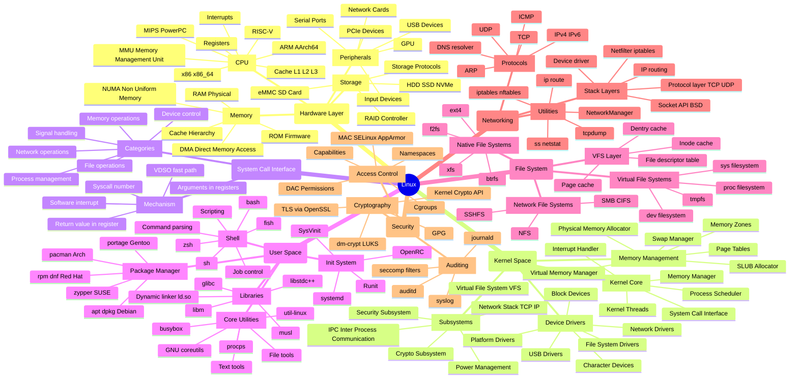

```mermaid
mindmap
  root((Linux))
    (Hardware Layer)
      [CPU]
        x86 x86_64
        ARM AArch64
        RISC-V
        MIPS PowerPC
        Registers
        Cache L1 L2 L3
        MMU Memory Management Unit
        Interrupts
      [Memory]
        RAM Physical
        ROM Firmware
        Cache Hierarchy
        DMA Direct Memory Access
        NUMA Non Uniform Memory
      [Storage]
        HDD SSD NVMe
        eMMC SD Card
        RAID Controller
        Storage Protocols
      [Peripherals]
        Network Cards
        GPU
        USB Devices
        PCIe Devices
        Serial Ports
        Input Devices

    (Kernel Space)
      [Kernel Core]
        Process Scheduler
        Memory Manager
        Interrupt Handler
        System Call Interface
        Kernel Threads
      [Device Drivers]
        Character Devices
        Block Devices
        Network Drivers
        File System Drivers
        USB Drivers
        Platform Drivers
      [Subsystems]
        Virtual File System VFS
        Network Stack TCP IP
        IPC Inter Process Communication
        Security Subsystem
        Power Management
        Crypto Subsystem
      [Memory Management]
        Physical Memory Allocator
        Virtual Memory Manager
        Page Tables
        Swap Manager
        SLUB Allocator
        Memory Zones

    (System Call Interface)
      [Categories]
        Process management
        File operations
        Network operations
        Memory operations
        Signal handling
        Device control
      [Mechanism]
        Syscall number
        Software interrupt
        VDSO fast path
        Arguments in registers
        Return value in register

    (User Space)
      [Init System]
        systemd
        SysVinit
        OpenRC
        Runit
      [Shell]
        bash
        zsh
        sh
        fish
        Command parsing
        Job control
        Scripting
      [Core Utilities]
        GNU coreutils
        busybox
        util-linux
        procps
        File tools
        Text tools
      [Libraries]
        glibc
        musl
        libstdc++
        libm
        Dynamic linker ld.so
      [Package Manager]
        apt dpkg Debian
        rpm dnf Red Hat
        pacman Arch
        zypper SUSE
        portage Gentoo

    (File System)
      [VFS Layer]
        Inode cache
        Dentry cache
        Page cache
        File descriptor table
      [Native File Systems]
        ext4
        xfs
        btrfs
        f2fs
      [Network File Systems]
        NFS
        SMB CIFS
        SSHFS
      [Virtual File Systems]
        proc filesystem
        sys filesystem
        dev filesystem
        tmpfs

    (Networking)
      [Stack Layers]
        Socket API BSD
        Protocol layer TCP UDP
        IP routing
        Netfilter iptables
        Device driver
      [Protocols]
        TCP
        UDP
        ICMP
        IPv4 IPv6
        ARP
        DNS resolver
      [Utilities]
        ip route
        ss netstat
        iptables nftables
        tcpdump
        NetworkManager

    (Security)
      [Access Control]
        DAC Permissions
        MAC SELinux AppArmor
        Capabilities
        Namespaces
        Cgroups
      [Cryptography]
        Kernel Crypto API
        dm-crypt LUKS
        TLS via OpenSSL
        GPG
      [Auditing]
        auditd
        syslog
        journald
        seccomp filters

```
