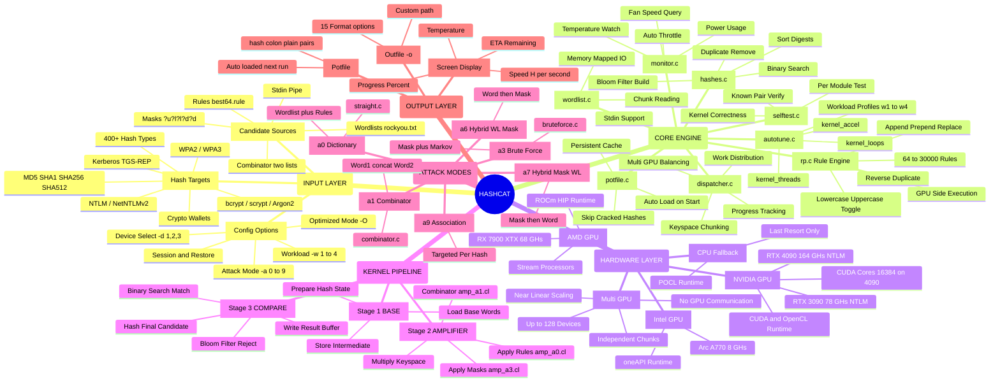

# Hashcat




```mermaid
sequenceDiagram
    actor User
    participant CLI as main.c / CLI
    participant Core as hashcat_core
    participant Module as Hash Module
    participant Backend as backend.c
    participant GPU as GPU Device
    participant Potfile as  Potfile

    User->>CLI: hashcat -m 1000 -a 0 hash.txt wordlist.txt -r best64.rule

    Note over CLI,Core: INITIALIZATION PHASE

    CLI->>Core: hashcat_init()
    Core->>Core: Parse arguments & load hctune DB
    Core-->>CLI: Config ready 

    CLI->>Module: Load module_01000.c (NTLM)
    Module->>Module: module_hash_decode()
    Module->>Module: module_kern_type()
    Module->>Module: module_opti_type()
    Module-->>CLI: Module loaded 

    CLI->>Potfile: Check already cracked hashes
    Potfile-->>CLI: Skip N already cracked

    CLI->>Backend: backend_init()
    Backend->>GPU: Enumerate OpenCL / CUDA devices
    GPU-->>Backend: Device info (VRAM, CUs, clock)
    Backend-->>CLI: Devices ready 

    CLI->>GPU: Compile OpenCL kernels
    Note right of GPU: m01000_a0-optimized.cl\namp_a0.cl\ninc_hash_md5.cl
    GPU->>GPU: JIT compile kernels
    GPU-->>CLI: Kernels cached 

    Note over Core,GPU: AUTO-TUNE PHASE

    CLI->>GPU: autotune() — run test kernel KA=1 KL=1
    loop Auto Tune Loop
        GPU->>GPU: Run kernel, measure ms
        GPU-->>Core: Execution time result
        Core->>Core: Time < target? Double KA or KL
    end
    Core-->>CLI: Optimal KA=128 KL=256 found 

    CLI->>GPU: selftest() — known hash/plain pair
    GPU-->>CLI: Self test passed 

    Note over User,GPU: MAIN CRACKING LOOP

    loop Every Batch Until Keyspace Exhausted
        Core->>Core: Read next wordlist chunk
        Core->>Core: Apply rules (rp.c) — best64.rule
        Note right of Core: 64 rules × 10K words\n= 640K candidates/batch

        Core->>GPU: Transfer candidates\nHost → Device buffer (d_pws_buf)

        GPU->>GPU: Stage 1 — BASE KERNEL\nLoad base words

        GPU->>GPU: Stage 2 — AMPLIFIER KERNEL amp_a0.cl\nApply rules to each base word

        GPU->>GPU: Stage 3 — HASH KERNEL m01000_a0.cl\nNTLM hash each candidate

        Note over GPU: BLOOM FILTER CHECK
        GPU->>GPU: Check bitmap stage 1
        GPU->>GPU: Check bitmap stage 2
        GPU->>GPU: Binary search in d_digests_buf

        GPU-->>Core: Return result buffer

        alt Match Found 
            Core->>Potfile: Write hash:plain to potfile
            Core-->>User: CRACKED — Password1!
        else No Match
            Core->>Core: Update progress / speed / ETA
        end

        Note over Core: HARDWARE MONITOR
        loop Temperature Watch
            Backend->>GPU: Query temperature
            GPU-->>Backend: Temp °C
            alt Overheating > 90°C
                Backend->>GPU: Throttle kernel launch
                Note right of Backend: Reduce speed\nprevent damage
            else Normal Temp
                Backend->>GPU: Continue full speed
            end
        end
    end

    Note over User,Potfile: FINISH

    Core->>Core: hashcat_session_destroy()
    Core->>GPU: Free VRAM buffers
    Core->>Backend: Release OpenCL contexts
    Core-->>User: Session complete\nResults in potfile
  ```

```mermaid
sequenceDiagram
    participant WL as Wordlist
    participant RE as Rule Engine rp.c
    participant AMP as Amplifier amp_a0.cl
    participant HASH as  Hash Kernel
    participant BF as  Bloom Filter
    participant BS as  Binary Search
    participant OUT as  Output

    Note over WL,OUT:  SINGLE BATCH — Dictionary + Rules Attack

    WL->>RE: Base word: "password"
    Note right of WL: Read chunk from\nwordlist.txt

    loop For Each Rule in best64.rule
        RE->>AMP: Rule 1 — as-is → "password"
        RE->>AMP: Rule 2 — c → "Password"
        RE->>AMP: Rule 3 — c $1 → "Password1"
        RE->>AMP: Rule 4 — c $1 $! → "Password1!"
        RE->>AMP: Rule 5 — sa@ → "p@ssword"
        RE->>AMP: Rule 6 — r → "drowssap"
        RE->>AMP: Rule N... → ...
    end

    Note over AMP,HASH: All candidates sent to GPU in parallel

    AMP->>HASH: Candidate batch → GPU threads
    Note right of AMP: Each GPU thread\nhandles 1 candidate

    loop GPU Threads — SIMT Parallel
        HASH->>HASH: NTLM hash candidate
        HASH->>BF: Send digest for comparison
    end

    loop Bloom Filter Stages
        BF->>BF: Stage 1 — bitmap_s1 check
        alt Stage 1 Miss
            BF-->>HASH: Reject — not a match
        else Stage 1 Hit
            BF->>BF: Stage 2 — bitmap_s2 check
            alt Stage 2 Miss
                BF-->>HASH: Reject — not a match
            else Stage 2 Hit — Possible Match
                BF->>BS: Send for full comparison
            end
        end
    end

    BS->>BS: Binary search O(log n)\nin sorted digest list
    alt Match Found
        BS->>OUT: hash:Password1!
        OUT->>OUT: Write to potfile
        OUT->>OUT: Write to outfile
    else No Match
        BS-->>HASH: Continue next candidate
    end
```
