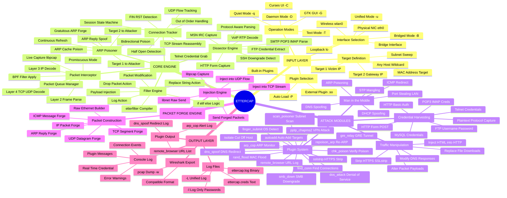

```mermaid
mindmap
  root((ETTERCAP))
    (INPUT LAYER)
      [Interface Selection]
        Physical NIC eth0
        Wireless wlan0
        Loopback lo
        Bridge Interface
        Unified Mode -u
        Bridged Mode -B
      [Target Definition]
        Target 1 Victim IP
        Target 2 Gateway IP
        MAC Address Target
        Subnet Sweep
        Any Host Wildcard
      [Plugin Selection]
        Built-in Plugins
        External Plugin .so
        Auto Load -P
      [Operation Modes]
        Text Mode -T
        Curses UI -C
        GTK GUI -G
        Daemon Mode -D
        Quiet Mode -q

    (CORE ENGINE)
      [ARP Poisoner]
        Gratuitous ARP Forge
        ARP Reply Spoof
        ARP Cache Poison
        Continuous Refresh
        Bidirectional Poison
        Target 1 to Attacker
        Target 2 to Attacker
      [Packet Interceptor]
        Live Capture libpcap
        BPF Filter Apply
        Promiscuous Mode
        Packet Queue Manager
        Layer 2 Frame Parse
        Layer 3 IP Decode
        Layer 4 TCP UDP Decode
      [Connection Tracker]
        TCP Stream Reassembly
        UDP Flow Tracking
        Session State Machine
        Half Open Detection
        FIN RST Detection
        Out of Order Handling
      [Dissector Engine]
        Protocol Aware Parsing
        FTP Credential Extract
        HTTP Form Capture
        SMTP POP3 IMAP Parse
        SSH Downgrade Detect
        Telnet Credential Grab
        MSN IRC Capture
        VoIP RTP Decode
      [Filter Engine]
        etterfilter Compiler
        if elif else Logic
        Packet Modification
        Payload Injection
        Drop Packet Action
        Replace String Action
        Log Action

    (ATTACK MODULES)
      [Man in the Middle]
        ARP Poisoning
        DNS Spoofing
        ICMP Redirect
        DHCP Spoofing
        Port Stealing LAN
        STP Mangling
      [Credential Harvesting]
        Plaintext Protocol Capture
        FTP Username Password
        HTTP Basic Auth
        HTTP Form POST
        Telnet Credentials
        POP3 IMAP Creds
        MySQL Credentials
      [Traffic Manipulation]
        Inject HTML into HTTP
        Replace File Downloads
        Strip HTTPS SSLstrip
        Modify DNS Responses
        Alter Packet Payloads
      [Plugin System]
        arp_cop ARP Monitor
        autoadd Auto Add Targets
        chk_poison Verify Poison
        dns_spoof DNS Redirect
        dos_attack Denial of Service
        finger_submit OS Detect
        find_conn Find Connections
        gre_relay GRE Tunnel
        isolate Cut Off Host
        pptp_chapms2 VPN Attack
        rand_flood MAC Flood
        remote_browser URL Log
        repoison_arp Re-ARP
        scan_poisoner Subnet Scan
        smb_down SMB Downgrade
        sslstrip HTTPS Strip

    (PACKET FORGE ENGINE)
      [Packet Construction]
        Raw Ethernet Builder
        IP Packet Forge
        TCP Segment Forge
        UDP Datagram Forge
        ICMP Message Forge
        ARP Reply Forge
      [Injection Engine]
        Inject into TCP Stream
        Inject into UDP Flow
        Send Forged Packets
        libnet Raw Send
        libpcap Capture

    (OUTPUT LAYER)
      [Console Log]
        Real Time Credential
        Connection Events
        Plugin Messages
        Error Warnings
      [Log Files]
        -L Unified Log
        -l Log Only Passwords
        ettercap.log Binary
        ettercap.creds Text
      [Wireshark Export]
        pcap Dump -w
        Compatible Format
      [Plugin Output]
        dns_spoof Redirect Log
        arp_cop Alert Log
        remote_browser URL List
```
