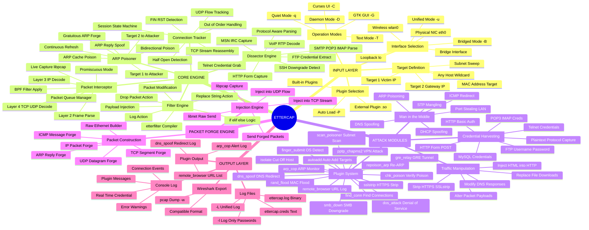
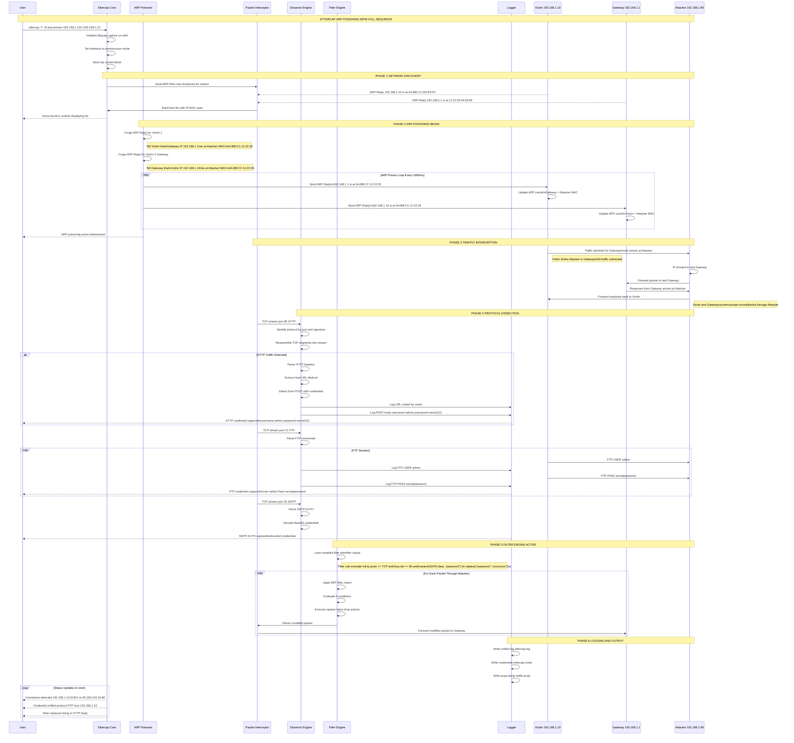

```mermaid
mindmap
  root((ETTERCAP))
    (INPUT LAYER)
      [Interface Selection]
        Physical NIC eth0
        Wireless wlan0
        Loopback lo
        Bridge Interface
        Unified Mode -u
        Bridged Mode -B
      [Target Definition]
        Target 1 Victim IP
        Target 2 Gateway IP
        MAC Address Target
        Subnet Sweep
        Any Host Wildcard
      [Plugin Selection]
        Built-in Plugins
        External Plugin .so
        Auto Load -P
      [Operation Modes]
        Text Mode -T
        Curses UI -C
        GTK GUI -G
        Daemon Mode -D
        Quiet Mode -q

    (CORE ENGINE)
      [ARP Poisoner]
        Gratuitous ARP Forge
        ARP Reply Spoof
        ARP Cache Poison
        Continuous Refresh
        Bidirectional Poison
        Target 1 to Attacker
        Target 2 to Attacker
      [Packet Interceptor]
        Live Capture libpcap
        BPF Filter Apply
        Promiscuous Mode
        Packet Queue Manager
        Layer 2 Frame Parse
        Layer 3 IP Decode
        Layer 4 TCP UDP Decode
      [Connection Tracker]
        TCP Stream Reassembly
        UDP Flow Tracking
        Session State Machine
        Half Open Detection
        FIN RST Detection
        Out of Order Handling
      [Dissector Engine]
        Protocol Aware Parsing
        FTP Credential Extract
        HTTP Form Capture
        SMTP POP3 IMAP Parse
        SSH Downgrade Detect
        Telnet Credential Grab
        MSN IRC Capture
        VoIP RTP Decode
      [Filter Engine]
        etterfilter Compiler
        if elif else Logic
        Packet Modification
        Payload Injection
        Drop Packet Action
        Replace String Action
        Log Action

    (ATTACK MODULES)
      [Man in the Middle]
        ARP Poisoning
        DNS Spoofing
        ICMP Redirect
        DHCP Spoofing
        Port Stealing LAN
        STP Mangling
      [Credential Harvesting]
        Plaintext Protocol Capture
        FTP Username Password
        HTTP Basic Auth
        HTTP Form POST
        Telnet Credentials
        POP3 IMAP Creds
        MySQL Credentials
      [Traffic Manipulation]
        Inject HTML into HTTP
        Replace File Downloads
        Strip HTTPS SSLstrip
        Modify DNS Responses
        Alter Packet Payloads
      [Plugin System]
        arp_cop ARP Monitor
        autoadd Auto Add Targets
        chk_poison Verify Poison
        dns_spoof DNS Redirect
        dos_attack Denial of Service
        finger_submit OS Detect
        find_conn Find Connections
        gre_relay GRE Tunnel
        isolate Cut Off Host
        pptp_chapms2 VPN Attack
        rand_flood MAC Flood
        remote_browser URL Log
        repoison_arp Re-ARP
        scan_poisoner Subnet Scan
        smb_down SMB Downgrade
        sslstrip HTTPS Strip

    (PACKET FORGE ENGINE)
      [Packet Construction]
        Raw Ethernet Builder
        IP Packet Forge
        TCP Segment Forge
        UDP Datagram Forge
        ICMP Message Forge
        ARP Reply Forge
      [Injection Engine]
        Inject into TCP Stream
        Inject into UDP Flow
        Send Forged Packets
        libnet Raw Send
        libpcap Capture

    (OUTPUT LAYER)
      [Console Log]
        Real Time Credential
        Connection Events
        Plugin Messages
        Error Warnings
      [Log Files]
        -L Unified Log
        -l Log Only Passwords
        ettercap.log Binary
        ettercap.creds Text
      [Wireshark Export]
        pcap Dump -w
        Compatible Format
      [Plugin Output]
        dns_spoof Redirect Log
        arp_cop Alert Log
        remote_browser URL List
```

```mermaid
sequenceDiagram
    participant User
    participant ET as Ettercap Core
    participant ARP as ARP Poisoner
    participant CAP as Packet Interceptor
    participant DIS as Dissector Engine
    participant FIL as Filter Engine
    participant LOG as Logger
    participant V1 as Victim 192.168.1.10
    participant V2 as Gateway 192.168.1.1
    participant ATK as Attacker 192.168.1.99

    Note over User,ATK: ETTERCAP ARP POISONING MITM FULL SEQUENCE

    User->>ET: ettercap -T -M arp:remote /192.168.1.10// /192.168.1.1//

    ET->>ET: Initialize libpcap capture on eth0
    ET->>ET: Set interface to promiscuous mode
    ET->>ET: Bind raw socket libnet

    Note over ET,ATK: PHASE 1 NETWORK DISCOVERY

    ET->>CAP: Send ARP Who-Has broadcast for subnet
    V1-->>CAP: ARP Reply 192.168.1.10 is at AA:BB:CC:DD:EE:FF
    V2-->>CAP: ARP Reply 192.168.1.1 is at 11:22:33:44:55:66
    CAP->>ET: Build host list with IP MAC pairs
    ET-->>User: Hosts found in subnet displaying list

    Note over ARP,ATK: PHASE 2 ARP POISONING BEGIN

    ARP->>ARP: Forge ARP Reply for Victim 1
    Note right of ARP: Tell Victim that\nGateway IP 192.168.1.1\nis at Attacker MAC\nAA:BB:CC:11:22:33

    ARP->>ARP: Forge ARP Reply for Victim 2 Gateway
    Note right of ARP: Tell Gateway that\nVictim IP 192.168.1.10\nis at Attacker MAC\nAA:BB:CC:11:22:33

    loop ARP Poison Loop Every 1000ms
        ARP->>V1: Send ARP Reply\n192.168.1.1 is at AA:BB:CC:11:22:33
        V1->>V1: Update ARP cache\nGateway = Attacker MAC
        ARP->>V2: Send ARP Reply\n192.168.1.10 is at AA:BB:CC:11:22:33
        V2->>V2: Update ARP cache\nVictim = Attacker MAC
    end

    ARP-->>User: ARP poisoning active bidirectional

    Note over CAP,ATK: PHASE 3 TRAFFIC INTERCEPTION

    V1->>ATK: Traffic destined for Gateway\nnow arrives at Attacker
    Note right of V1: Victim thinks Attacker is Gateway\nAll traffic redirected

    ATK->>ATK: IP forward to real Gateway
    ATK->>V2: Forward packet to real Gateway
    V2->>ATK: Response from Gateway arrives at Attacker
    ATK->>V1: Forward response back to Victim
    Note right of ATK: Victim and Gateway\ncommunicate normally\nbut through Attacker

    Note over DIS,ATK: PHASE 4 PROTOCOL DISSECTION

    CAP->>DIS: TCP stream port 80 HTTP
    DIS->>DIS: Identify protocol by port and signature
    DIS->>DIS: Reassemble TCP segments into stream

    alt HTTP Traffic Detected
        DIS->>DIS: Parse HTTP headers
        DIS->>DIS: Extract Host URL Method
        DIS->>DIS: Detect form POST with credentials
        DIS->>LOG: Log URL visited by victim
        DIS->>LOG: Log POST body username=admin password=secret123
        LOG-->>User: HTTP credential captured\nusername admin password secret123
    end

    CAP->>DIS: TCP stream port 21 FTP
    DIS->>DIS: Parse FTP commands

    loop FTP Session
        V1->>ATK: FTP USER admin
        DIS->>LOG: Log FTP USER admin
        V1->>ATK: FTP PASS secretpassword
        DIS->>LOG: Log FTP PASS secretpassword
        LOG-->>User: FTP credential captured\nUser admin Pass secretpassword
    end

    CAP->>DIS: TCP stream port 25 SMTP
    DIS->>DIS: Parse SMTP AUTH
    DIS->>DIS: Decode Base64 credentials
    LOG-->>User: SMTP AUTH captured\ndecoded credentials

    Note over FIL,ATK: PHASE 5 FILTER ENGINE ACTIVE

    FIL->>FIL: Load compiled filter etterfilter output
    Note right of FIL: Filter rule example:\nif ip.proto == TCP and\ntcp.dst == 80 and\nsearch(DATA.data, "password") {\n  replace("password","xxxxxxxxx")\n}

    loop For Each Packet Through Attacker
        FIL->>FIL: Apply BPF filter match
        FIL->>FIL: Evaluate if conditions
        FIL->>FIL: Execute replace inject drop actions
        FIL->>CAP: Return modified packet
        CAP->>V2: Forward modified packet to Gateway
    end

    Note over LOG,ATK: PHASE 6 LOGGING AND OUTPUT

    LOG->>LOG: Write unified log ettercap.log
    LOG->>LOG: Write credentials ettercap.creds
    LOG->>LOG: Write pcap dump traffic.pcap

    loop Status Updates to User
        ET-->>User: Connection detected 192.168.1.10:54321 to 93.184.216.34:80
        ET-->>User: Credential sniffed protocol FTP host 192.168.1.10
        ET-->>User: Filter replaced string in HTTP body
    end
```
