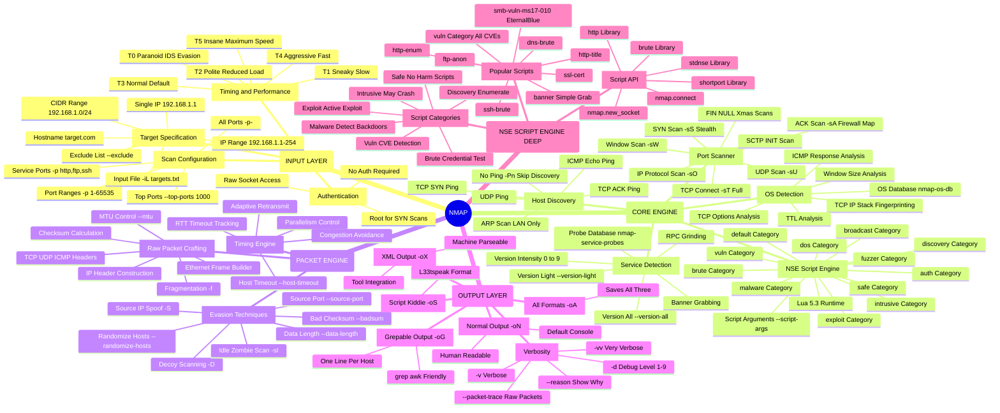

```mermaid
mindmap
  root((NMAP))
    (INPUT LAYER)
      [Target Specification]
        Single IP 192.168.1.1
        CIDR Range 192.168.1.0/24
        Hostname target.com
        IP Range 192.168.1.1-254
        Input File -iL targets.txt
        Exclude List --exclude
      [Scan Configuration]
        Port Ranges -p 1-65535
        Top Ports --top-ports 1000
        All Ports -p-
        Service Ports -p http,ftp,ssh
      [Timing and Performance]
        T0 Paranoid IDS Evasion
        T1 Sneaky Slow
        T2 Polite Reduced Load
        T3 Normal Default
        T4 Aggressive Fast
        T5 Insane Maximum Speed
      [Authentication]
        No Auth Required
        Root for SYN Scans
        Raw Socket Access

    (CORE ENGINE)
      [Host Discovery]
        ICMP Echo Ping
        TCP SYN Ping
        TCP ACK Ping
        UDP Ping
        ARP Scan LAN Only
        No Ping -Pn Skip Discovery
      [Port Scanner]
        SYN Scan -sS Stealth
        TCP Connect -sT Full
        UDP Scan -sU
        ACK Scan -sA Firewall Map
        Window Scan -sW
        FIN NULL Xmas Scans
        SCTP INIT Scan
        IP Protocol Scan -sO
      [Service Detection]
        Banner Grabbing
        Probe Database nmap-service-probes
        Version Intensity 0 to 9
        Version Light --version-light
        Version All --version-all
        RPC Grinding
      [OS Detection]
        TCP IP Stack Fingerprinting
        TTL Analysis
        Window Size Analysis
        TCP Options Analysis
        ICMP Response Analysis
        OS Database nmap-os-db
      [NSE Script Engine]
        auth Category
        broadcast Category
        brute Category
        default Category
        discovery Category
        dos Category
        exploit Category
        fuzzer Category
        intrusive Category
        malware Category
        safe Category
        vuln Category
        Lua 5.3 Runtime
        Script Arguments --script-args

    (PACKET ENGINE)
      [Raw Packet Crafting]
        Ethernet Frame Builder
        IP Header Construction
        TCP UDP ICMP Headers
        Checksum Calculation
        Fragmentation -f
        MTU Control --mtu
      [Evasion Techniques]
        Decoy Scanning -D
        Source IP Spoof -S
        Source Port --source-port
        Data Length --data-length
        Randomize Hosts --randomize-hosts
        Idle Zombie Scan -sI
        Bad Checksum --badsum
      [Timing Engine]
        RTT Timeout Tracking
        Adaptive Retransmit
        Parallelism Control
        Congestion Avoidance
        Host Timeout --host-timeout

    (OUTPUT LAYER)
      [Normal Output -oN]
        Human Readable
        Default Console
      [XML Output -oX]
        Machine Parseable
        Tool Integration
      [Grepable Output -oG]
        One Line Per Host
        grep awk Friendly
      [Script Kiddie -oS]
        L33tspeak Format
      [All Formats -oA]
        Saves All Three
      [Verbosity]
        -v Verbose
        -vv Very Verbose
        -d Debug Level 1-9
        --reason Show Why
        --packet-trace Raw Packets

    (NSE SCRIPT ENGINE DEEP)
      [Script Categories]
        Safe No Harm Scripts
        Intrusive May Crash
        Vuln CVE Detection
        Exploit Active Exploit
        Brute Credential Test
        Discovery Enumerate
        Malware Detect Backdoors
      [Popular Scripts]
        http-title
        ssl-cert
        smb-vuln-ms17-010 EternalBlue
        ftp-anon
        ssh-brute
        dns-brute
        http-enum
        vuln Category All CVEs
        banner Simple Grab
      [Script API]
        nmap.new_socket
        nmap.connect
        stdnse Library
        shortport Library
        brute Library
        http Library
```
