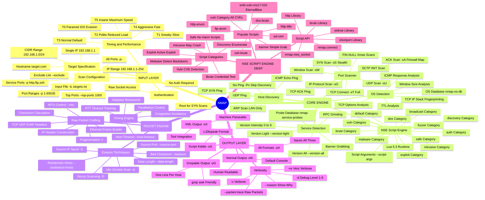
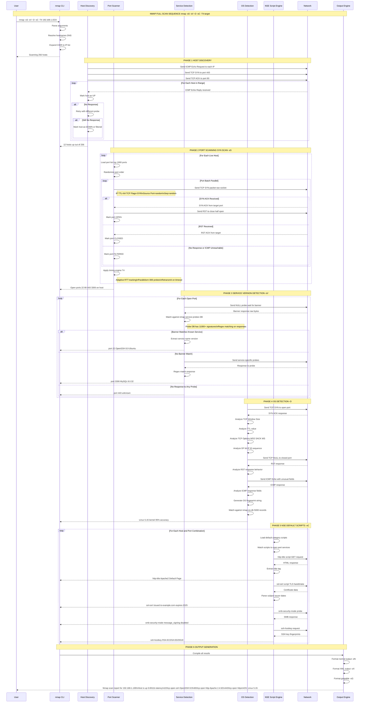

```mermaid
mindmap
  root((NMAP))
    (INPUT LAYER)
      [Target Specification]
        Single IP 192.168.1.1
        CIDR Range 192.168.1.0/24
        Hostname target.com
        IP Range 192.168.1.1-254
        Input File -iL targets.txt
        Exclude List --exclude
      [Scan Configuration]
        Port Ranges -p 1-65535
        Top Ports --top-ports 1000
        All Ports -p-
        Service Ports -p http,ftp,ssh
      [Timing and Performance]
        T0 Paranoid IDS Evasion
        T1 Sneaky Slow
        T2 Polite Reduced Load
        T3 Normal Default
        T4 Aggressive Fast
        T5 Insane Maximum Speed
      [Authentication]
        No Auth Required
        Root for SYN Scans
        Raw Socket Access

    (CORE ENGINE)
      [Host Discovery]
        ICMP Echo Ping
        TCP SYN Ping
        TCP ACK Ping
        UDP Ping
        ARP Scan LAN Only
        No Ping -Pn Skip Discovery
      [Port Scanner]
        SYN Scan -sS Stealth
        TCP Connect -sT Full
        UDP Scan -sU
        ACK Scan -sA Firewall Map
        Window Scan -sW
        FIN NULL Xmas Scans
        SCTP INIT Scan
        IP Protocol Scan -sO
      [Service Detection]
        Banner Grabbing
        Probe Database nmap-service-probes
        Version Intensity 0 to 9
        Version Light --version-light
        Version All --version-all
        RPC Grinding
      [OS Detection]
        TCP IP Stack Fingerprinting
        TTL Analysis
        Window Size Analysis
        TCP Options Analysis
        ICMP Response Analysis
        OS Database nmap-os-db
      [NSE Script Engine]
        auth Category
        broadcast Category
        brute Category
        default Category
        discovery Category
        dos Category
        exploit Category
        fuzzer Category
        intrusive Category
        malware Category
        safe Category
        vuln Category
        Lua 5.3 Runtime
        Script Arguments --script-args

    (PACKET ENGINE)
      [Raw Packet Crafting]
        Ethernet Frame Builder
        IP Header Construction
        TCP UDP ICMP Headers
        Checksum Calculation
        Fragmentation -f
        MTU Control --mtu
      [Evasion Techniques]
        Decoy Scanning -D
        Source IP Spoof -S
        Source Port --source-port
        Data Length --data-length
        Randomize Hosts --randomize-hosts
        Idle Zombie Scan -sI
        Bad Checksum --badsum
      [Timing Engine]
        RTT Timeout Tracking
        Adaptive Retransmit
        Parallelism Control
        Congestion Avoidance
        Host Timeout --host-timeout

    (OUTPUT LAYER)
      [Normal Output -oN]
        Human Readable
        Default Console
      [XML Output -oX]
        Machine Parseable
        Tool Integration
      [Grepable Output -oG]
        One Line Per Host
        grep awk Friendly
      [Script Kiddie -oS]
        L33tspeak Format
      [All Formats -oA]
        Saves All Three
      [Verbosity]
        -v Verbose
        -vv Very Verbose
        -d Debug Level 1-9
        --reason Show Why
        --packet-trace Raw Packets

    (NSE SCRIPT ENGINE DEEP)
      [Script Categories]
        Safe No Harm Scripts
        Intrusive May Crash
        Vuln CVE Detection
        Exploit Active Exploit
        Brute Credential Test
        Discovery Enumerate
        Malware Detect Backdoors
      [Popular Scripts]
        http-title
        ssl-cert
        smb-vuln-ms17-010 EternalBlue
        ftp-anon
        ssh-brute
        dns-brute
        http-enum
        vuln Category All CVEs
        banner Simple Grab
      [Script API]
        nmap.new_socket
        nmap.connect
        stdnse Library
        shortport Library
        brute Library
        http Library
```

```mermaid

sequenceDiagram
    participant User
    participant CLI as nmap CLI
    participant HD as Host Discovery
    participant PS as Port Scanner
    participant SD as Service Detection
    participant OD as OS Detection
    participant NSE as NSE Script Engine
    participant NET as Network
    participant OUT as Output Engine

    Note over User,OUT: NMAP FULL SCAN SEQUENCE nmap -sS -sV -O -sC -T4 target

    User->>CLI: nmap -sS -sV -O -sC -T4 192.168.1.0/24

    CLI->>CLI: Parse arguments
    CLI->>CLI: Resolve hostnames DNS
    CLI->>CLI: Expand CIDR to IP list
    CLI-->>User: Scanning 256 hosts

    Note over HD,NET: PHASE 1 HOST DISCOVERY

    HD->>NET: Send ICMP Echo Request to each IP
    HD->>NET: Send TCP SYN to port 443
    HD->>NET: Send TCP ACK to port 80

    loop For Each Host in Range
        NET-->>HD: ICMP Echo Reply received
        HD->>HD: Mark host as UP
        alt No Response
            HD->>HD: Retry with different probe
            alt Still No Response
                HD->>HD: Mark host as DOWN or filtered
            end
        end
    end

    HD-->>CLI: 12 hosts up out of 256

    Note over PS,NET: PHASE 2 PORT SCANNING SYN SCAN -sS

    loop For Each Live Host
        PS->>PS: Load port list top 1000 ports
        PS->>PS: Randomize port order

        loop Port Batch Parallel
            PS->>NET: Send TCP SYN packet raw socket
            Note right of PS: IP TTL=64 TCP Flags=SYN\nSource Port=random\nSeq=random

            alt SYN ACK Received
                NET-->>PS: SYN ACK from target port
                PS->>NET: Send RST to close half open
                PS->>PS: Mark port OPEN
            else RST Received
                NET-->>PS: RST ACK from target
                PS->>PS: Mark port CLOSED
            else No Response or ICMP Unreachable
                PS->>PS: Mark port FILTERED
            end
        end

        PS->>PS: Apply timing engine T4
        Note right of PS: Adaptive RTT tracking\nParallelism=300 probes\nRetransmit on timeout
    end

    PS-->>CLI: Open ports 22 80 443 3306 on host

    Note over SD,NET: PHASE 3 SERVICE VERSION DETECTION -sV

    loop For Each Open Port
        SD->>NET: Send NULL probe wait for banner
        NET-->>SD: Banner response raw bytes

        SD->>SD: Match against nmap-service-probes DB
        Note right of SD: Probe DB has 11000+ signatures\nRegex matching on responses

        alt Banner Matches Known Service
            SD->>SD: Extract service name version
            SD-->>CLI: port 22 OpenSSH 8.9 Ubuntu
        else No Banner Match
            SD->>NET: Send service-specific probes
            NET-->>SD: Response to probe
            SD->>SD: Regex match response
            SD-->>CLI: port 3306 MySQL 8.0.32
        else No Response to Any Probe
            SD-->>CLI: port 443 unknown
        end
    end

    Note over OD,NET: PHASE 4 OS DETECTION -O

    OD->>NET: Send TCP SYN to open port
    NET-->>OD: SYN ACK response
    OD->>OD: Analyze TCP Window Size
    OD->>OD: Analyze TTL value
    OD->>OD: Analyze TCP Options MSS SACK WS
    OD->>OD: Analyze DF bit IP ID sequence

    OD->>NET: Send TCP NULL to closed port
    NET-->>OD: RST response
    OD->>OD: Analyze RST response behavior

    OD->>NET: Send ICMP Echo with unusual fields
    NET-->>OD: ICMP response
    OD->>OD: Analyze ICMP response fields

    OD->>OD: Generate OS fingerprint string
    OD->>OD: Match against nmap-os-db 5000 records
    OD-->>CLI: Linux 5.15 kernel 95% accuracy

    Note over NSE,NET: PHASE 5 NSE DEFAULT SCRIPTS -sC

    loop For Each Host and Port Combination
        NSE->>NSE: Load default category scripts
        NSE->>NSE: Match scripts to open port services

        NSE->>NET: http-title script GET request
        NET-->>NSE: HTML response
        NSE->>NSE: Extract title tag
        NSE-->>CLI: http-title Apache2 Default Page

        NSE->>NET: ssl-cert script TLS handshake
        NET-->>NSE: Certificate data
        NSE->>NSE: Parse subject issuer dates
        NSE-->>CLI: ssl-cert Issued to example.com expires 2025

        NSE->>NET: smb-security-mode probe
        NET-->>NSE: SMB response
        NSE-->>CLI: smb-security-mode message_signing disabled

        NSE->>NET: ssh-hostkey request
        NET-->>NSE: SSH key fingerprints
        NSE-->>CLI: ssh-hostkey RSA ECDSA ED25519
    end

    Note over CLI,OUT: PHASE 6 OUTPUT GENERATION

    CLI->>OUT: Compile all results
    OUT->>OUT: Format normal output -oN
    OUT->>OUT: Format XML output -oX
    OUT->>OUT: Format grepable -oG
    OUT-->>User: Nmap scan report for 192.168.1.100\nHost is up 0.0012s latency\n22/tcp open ssh OpenSSH 8.9\n80/tcp open http Apache 2.4.52\n443/tcp open https\nOS: Linux 5.15
```
